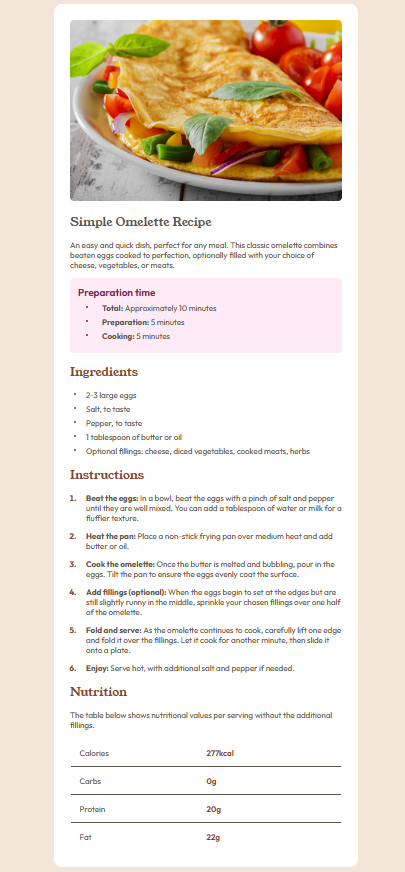

# Frontend Mentor - Recipe page solution

This is a solution to the [Recipe page challenge on Frontend Mentor](https://www.frontendmentor.io/challenges/recipe-page-KiTsR8QQKm). Frontend Mentor challenges help you improve your coding skills by building realistic projects. 

## Table of contents

- [Overview](#overview)
  - [The challenge](#the-challenge)
  - [Screenshot](#screenshot)
  - [Links](#links)
- [My process](#my-process)
  - [Built with](#built-with)
  - [What I learned](#what-i-learned)
  - [Continued development](#continued-development)
- [Author](#author)
- [Acknowledgments](#acknowledgments)

## Overview

### Screenshot

[FireShot](https://getfireshot.com/)

### Links

- Live Site URL: [Add live site URL here](https://ricardo1003.github.io/recipe-page-main/)

## My process

### Built with

- Semantic HTML5 markup
- CSS custom properties
- Flexbox
- CSS Grid

### What I learned

In this proyect i remembered some things about flexbox, grid, tables, lists, articles and sections.
It didnt took to much efford, but i had to search some topics online to understand and use them, so next time i encounter with similar problems it is easyer to solve them.
.**

### Continued development

I need to learn more about lists and how to style better the dots/numbers

## Author

- Github - [ricardo1003](https://github.com/ricardo1003)
- Frontend Mentor - [@ricardo1003](https://www.frontendmentor.io/profile/ricardo1003)
